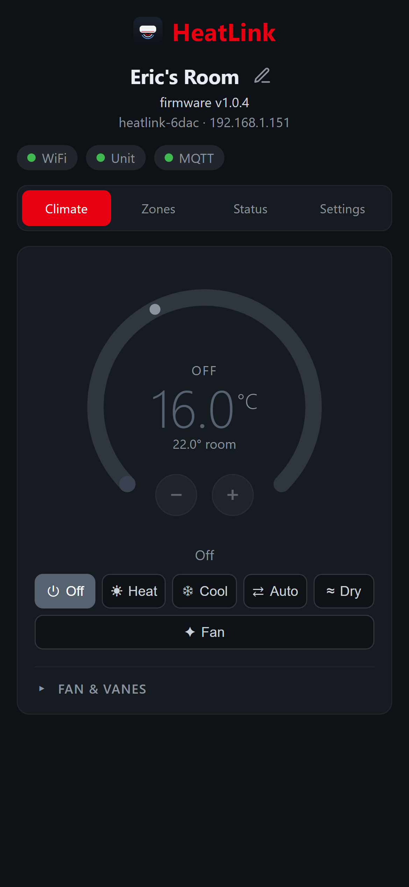
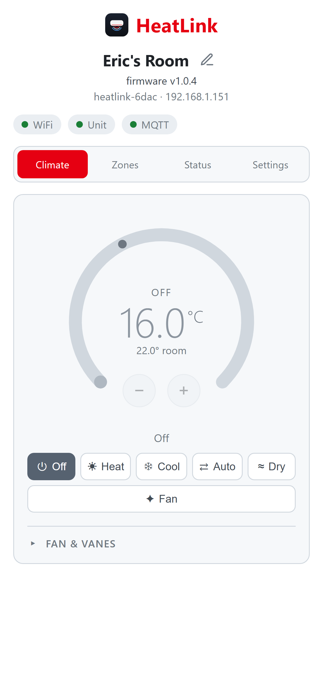
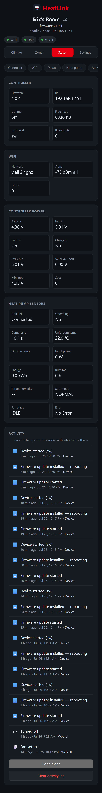
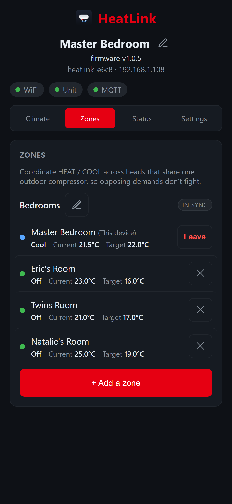
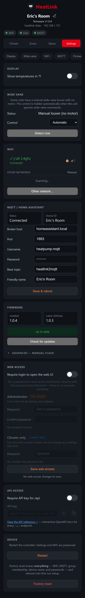

# HeatLink

**A tiny, 100 %-local WiFi controller for Mitsubishi Electric mini-splits — with
a full touch web UI, a documented REST API, native Home Assistant integration,
and one-of-a-kind multi-head zone coordination. No cloud, no subscription, no
proprietary hub.**

HeatLink is ESP-IDF firmware for an **M5Stack Stamp-S3Bat** (ESP32-S3) that talks
to a **Mitsubishi Electric** indoor unit over its **CN105** service port and
bridges it to **Home Assistant over MQTT** — while also serving a polished,
phone-friendly control panel and a clean JSON API directly from the device.

Solder four wires to a CN105 pigtail (the 12 V pin is left unconnected), flash
the board, and you get a thermostat you fully own: it runs on your LAN, survives
internet outages, and exposes every capability over an open API so you can build
whatever front-end you like — a custom WiFi remote, a wall-mounted tablet
dashboard, a physical knob, or a Node/Python automation.

And uniquely, when several indoor heads share one outdoor compressor, HeatLink
units **coordinate their HEAT/COOL demands with each other over your LAN** so
they never fight the shared unit — to our knowledge the first open Mitsubishi
bridge to solve this multi-zone problem.

HeatLink descends from the lineage of
[`mitsubishi2MQTT`](https://github.com/gysmo38/mitsubishi2MQTT) (Arduino/ESP8266)
and the CN105 protocol work in [SwiCago/HeatPump][swicago], rebuilt from the
ground up on ESP-IDF with its own web UI, REST API, and MQTT schema.

<p align="center">
  
  
</p>

## Why HeatLink?

Most Mitsubishi WiFi options are either a cloud adapter (Kumo Cloud / MELCloud —
your thermostat stops working when their servers do) or a bare protocol bridge
with no UI of its own. HeatLink is different:

- 🌐 **100 % local, no cloud, no account.** Everything runs on the device and
  your LAN. Nothing phones home.
- 🧊 **Multi-head zone coordination — a HeatLink first.** When several indoor
  heads share one outdoor compressor, Mitsubishi hardware forces them all into
  the *same* HEAT-or-COOL mode; ask two rooms for opposing modes and they fight
  the compressor. HeatLink units negotiate over your LAN, elect a coordinator,
  and lock the shared unit to one demand — to our knowledge no other open
  Mitsubishi bridge solves this.
- 📱 **A real web UI, not just a bridge.** A responsive touch dashboard —
  temperature dial, mode/fan/vane controls, live status, and settings — served
  straight off the ESP32 at `http://heatlink-<id>.local/`. Light & dark themes,
  iOS-PWA-ready (installable, safe-area aware for notch/Dynamic-Island phones).
- 🔌 **An open, documented REST API + OpenAPI spec.** Every capability the UI
  has is a plain JSON endpoint ([`openapi.yaml`](openapi.yaml), browsable in-app
  via Swagger UI). Build a **custom WiFi remote, a wall controller, a kiosk
  dashboard, or a scripted automation** without touching the firmware.
- 🏠 **First-class Home Assistant.** MQTT auto-discovery publishes a climate
  entity, a firmware **update** entity, and diagnostic sensors/buttons — no YAML.
- ⚡ **Power-integrity diagnostics you won't find elsewhere.** The board runs off
  the CN105 5 V rail, so HeatLink actively monitors and *counts* **brownouts**,
  **input-voltage sags**, and **WiFi drops**, surfaces min-input-voltage and
  battery state, and lets you reset those counters from the UI or Home Assistant.
  A closed-loop **PMIC charge governor** buffers the rail with a small LiPo so the
  module rides through power blips a naked bridge would crash on.
- 🔎 **Capability auto-detection.** Probes the unit (e.g. powered vs. manual
  wide-vane louver) and hides controls the hardware doesn't actually support.
- 🚀 **Painless updates.** OTA via drag-and-drop, HTTPS URL, MQTT, or one-click
  **GitHub self-update**, all with A/B partitions and automatic rollback.
- 📡 **Self-provisioning & self-discovery.** Captive-portal WiFi setup on first
  boot, mDNS hostname, and DNS-SD advertisement so tools can find every unit.

> **Status: working.** Architecture, threading, WiFi (incl. captive-portal
> provisioning + mDNS), the on-device web UI / REST API, the MQTT client +
> Home Assistant discovery (climate + firmware `update` entities), the PMIC I²C
> driver, and the **CN105 packet engine** are all in place; deployed units drive
> real indoor units and report live telemetry. A multi-head **zone coordination**
> layer keeps heads that share one outdoor compressor from fighting over
> HEAT/COOL. CI builds green.

## Hardware

The controller is an off-the-shelf **[M5Stack Stamp-S3Bat][stamp]** module — an
ESP32-S3 (`ESP32-S3-PICO-1-N8R8`, 8 MB flash / 8 MB PSRAM) with an on-board
battery/PMIC subsystem, so a single small LiPo buffers the whole thing off the
heat pump's own 5 V rail. No custom PCB is required; you solder four wires from
its castellated pads to a CN105 cable.

| Part | Role |
|------|------|
| [M5Stack Stamp-S3Bat][stamp] (`ESP32-S3-PICO-1-N8R8`) | application MCU + WiFi |
| M5MP1 PMIC (I²C `0x6E`, on-module) | rails, Li-ion charge gate (`CHG_EN`), VBAT/VIN telemetry |
| LGS4056HDA-4.35 (on-module) | Li-ion charger |
| 400 mAh LiPo ([Adafruit 3898][lipo], SH1.0-2P) | buffer for CN105 power blips + WiFi TX spikes |

[stamp]: https://shop.m5stack.com/products/m5stamps3-bat-module-with-battery-connector
[lipo]: https://www.adafruit.com/product/3898

The CN105 5 V rail is current-limited, so the firmware runs a **closed-loop
charge governor** (`m5pm1::PMIC::governor_tick`) that gates `CHG_EN` on the VIN
reading to keep input draw within budget — that's what lets the module run
directly off CN105 5 V with the LiPo absorbing transients. See
`components/m5pm1/`. Board pinout and schematic: the
[M5Stack Stamp-S3Bat docs][stampdocs].

[stampdocs]: https://docs.m5stack.com/en/core/Stamp-S3Bat

### Default pin map (override in `menuconfig` → *Component config → HeatLink Controller*)

| Function | GPIO | Notes |
|----------|------|-------|
| CN105 UART TX (→ heat pump RX, CN105 pin 5) | **GPIO 1** | UART port 1, 2400 baud 8E1 |
| CN105 UART RX (← heat pump TX, CN105 pin 4) | **GPIO 2** | |
| PMIC I²C SDA / SCL | **48 / 47** | internal bus (per S015 schematic); don't remap |

Defaults live in [`main/Kconfig.projbuild`](main/Kconfig.projbuild)
(`CN105_UART_TX_PIN`, `CN105_UART_RX_PIN`, `CN105_UART_PORT`, `PMIC_I2C_*`).

### CN105 connector & cable

Mitsubishi indoor units expose a 5-pin **CN105** service header. The mating
connector is a **JST PA series, 2.0 mm pitch, 5-position** housing:
[JST **PAP-05V-S**][pap] (the DigiKey part) with **SPH-002T-P0.5S** crimp
terminals. Crimping JST PA by hand is fiddly, so **a pre-made CN105 pigtail is
the easy path**. Ready-to-buy options include this
[pre-terminated CN105 cable on Amazon][amzn] and the pre-wired cables from
[Serin Labs][serin]; or search "Mitsubishi CN105 cable/pigtail" for more.

[pap]: https://www.digikey.com/en/products/detail/jst-sales-america-inc/pap-05v-s/759977
[amzn]: https://www.amazon.com/dp/B0DJT6D67S
[serin]: https://serin-labs.com/wiring.html

**CN105 pinout** (looking at the header on the indoor-unit PCB) and how it maps
to the Stamp-S3Bat:

| CN105 pin | Signal | Wire to Stamp-S3Bat |
|-----------|--------|---------------------|
| 1 | **12 V** | **do not connect** |
| 2 | GND | `GND` |
| 3 | 5 V | `5V`/`VIN` (powers the module + charges the LiPo) |
| 4 | TX (data **from** the heat pump) | **RX** → GPIO 2 |
| 5 | RX (data **to** the heat pump) | **TX** → GPIO 1 |

The data lines are **crossed** — heat-pump TX → ESP RX, heat-pump RX → ESP TX.
The CN105 bus is **5 V TTL** while the ESP32-S3 GPIOs are 3.3 V (not 5 V
tolerant); many builds direct-connect and work, but a small level shifter on the
ESP **RX** line is the electrically-correct choice. Always plug/unplug the
connector with the unit powered **off**, and never wire pin 1 (12 V) to the ESP.

Good background/wiring references (they target ESPHome/Arduino but the wiring and
protocol are identical):

- [SwiCago/HeatPump][swicago] — the original CN105 protocol library this port is based on
- [Serin Labs wiring guide][serin] — CN105 pinout + diagrams
- [ESPHome `mitsubishi_cn105`][esphome] and [echavet/MitsubishiCN105ESPHome][echavet]

[swicago]: https://github.com/SwiCago/HeatPump
[esphome]: https://esphome.io/components/climate/mitsubishi_cn105/
[echavet]: https://github.com/echavet/MitsubishiCN105ESPHome

## Architecture

```
              app_main
                 │
   ┌─────────────┼───────────────┬────────────────┐
   ▼             ▼               ▼                ▼
 m5pm1        wifi_manager    hvac_mqtt          cn105
 (PMIC,       (STA + SoftAP   (esp-mqtt, HA      (Mitsubishi
  charge       provisioning)   discovery, LWT)    CN105 protocol)
  governor)
   │                             ▲   │              │
   │ pmic_task (1 Hz)            │   │ commands     │ cn105_task (10 Hz)
   └────────────────────────────┘   └──────────────┘
```

## MQTT contract

Base: `<base_topic>/<friendly_name>`

| Direction | Topic suffix |
|-----------|--------------|
| subscribe | `/mode/set` `/temp/set` `/remote_temp/set` `/fan/set` `/vane/set` `/wideVane/set` `/system/set` `/ota/set` `/update/install` `/diag/reset_brownout` `/diag/reset_wifi_drops` |
| publish | `/state` (retained) `/settings` `/availability` (LWT) `/update/state` (retained) `/diag/state` (retained) `/group/state` (retained) `/debug/packets` `/debug/logs` |
| discovery | `homeassistant/climate/<friendly_name>/config` · `homeassistant/update/<friendly_name>/config` · diagnostic `sensor`/`button`/`binary_sensor` entities (brownout & WiFi-drop counts + reset buttons, group/conflict state) — all retained |

Beyond the climate entity, Home Assistant auto-discovers **diagnostic sensors**
(brownout count, WiFi-drop count, group/compressor-conflict state) and **reset
buttons** (reset brownout count, reset WiFi drops), so the same diagnostics the
web UI shows are available as native HA entities you can chart, alert, or
automate on.

## Build / flash

ESP-IDF **v5.4.3** (matches CI).

```bash
# one-time, or after cleaning
idf.py set-target esp32s3

# bench config: copy and edit local creds (gitignored)
cp sdkconfig.defaults.local.example sdkconfig.defaults.local

idf.py build
idf.py -p <PORT> flash monitor
```

WiFi can be set at build time (`sdkconfig.defaults.local` / `menuconfig`) or at
runtime (NVS, via the captive-portal SoftAP). On first boot with no credentials
the device starts a `heatlink-XXXX` SoftAP (captive portal at
`http://192.168.4.1/`); pick a network and enter the passphrase, and it saves to
NVS and reboots into STA mode. The **MQTT broker** is **not baked into the
firmware** by default (open-source builds ship with no broker), so on first boot
a fresh unit comes up unconfigured and you enter the broker at runtime from the
web UI (**Settings → MQTT / Home Assistant**), persisted to NVS; saving reboots the
device. Additional units can instead **inherit** the broker by joining an
existing group. (Personal builds may still bake a default broker via
`CONFIG_MQTT_BROKER_URI` in `sdkconfig.defaults.local`.) Each unit derives a short
hardware-unique id from its factory MAC (e.g. `E608`) that is reused everywhere
so multiple units never collide: the SoftAP name (`heatlink-<id>`),
the **mDNS hostname** (`heatlink-<id>.local`), and the default MQTT
node (leaving `friendly_name` blank yields `heatlink-<id>`). The same id is the
HA `unique_id`/device identity. Units are also **self-discoverable** via DNS-SD:
each advertises an `_http._tcp` service with TXT records (`id`, `fw`, `model`,
`path`), so `avahi-browse -rt _http._tcp` / Bonjour / a controller can list every
unit without knowing the hostname.

## Web UI / REST API

Once connected to WiFi the device serves a responsive touch dashboard at
`http://<ip>/` (or `http://heatlink-<id>.local/` via mDNS, where `<id>` is the
unit's MAC suffix shown on the Status tab). It has four tabs — **Climate**
(temperature dial, mode, fan & vanes), **Zones** (multi-head pairing &
coordination), **Status** (live diagnostics — WiFi, controller power, heat-pump
sensors, activity log), and **Settings** (display, wide-vane, WiFi, MQTT/HA,
firmware, web/API access, device reset). It works standalone as a thermostat, or
alongside MQTT/Home Assistant.

<table>
  <tr>
    <td align="center" valign="top" width="33%"><b>Status &amp; diagnostics</b><br><br></td>
    <td align="center" valign="top" width="33%"><b>Zones (multi-head)</b><br><br></td>
    <td align="center" valign="top" width="33%"><b>Settings</b><br><br></td>
  </tr>
</table>

Everything the UI does is backed by the same JSON API — so you can drive the unit
from a script, a wall panel, or your own front-end. The full contract lives in
[`openapi.yaml`](openapi.yaml) and is browsable in-app (Swagger UI, linked from
**Settings → API access**). Optional per-endpoint API-key auth can be enabled
there.

### Control & status

| Method | Path | Purpose |
|--------|------|---------|
| `GET`  | `/` | gzip'd dashboard |
| `GET`  | `/api/status` | version, ip, ssid, uptime, free heap, unit/MQTT link, PMIC power telemetry, diagnostics (brownout/WiFi-drop counts, sags, min VIN) |
| `GET`  | `/api/settings` | current heat-pump settings + status |
| `POST` | `/api/settings` | apply any subset of `{power,mode,temperature,fan,vane,wideVane,remoteTemp}` |
| `GET`  | `/api/capabilities` | detected unit capabilities (e.g. wide-vane) + override |
| `POST` | `/api/capabilities` | trigger a capability probe / set an override |
| `GET`  | `/api/events` | activity log (who changed what, paginated) |
| `DELETE` | `/api/events` | clear the activity log |

### Diagnostics

| Method | Path | Purpose |
|--------|------|---------|
| `POST` | `/api/diag/reset-brownout` | reset the persisted brownout counter |
| `POST` | `/api/diag/reset-wifi-drops` | reset the WiFi-drop counter |

### Provisioning & configuration

| Method | Path | Purpose |
|--------|------|---------|
| `GET`/`POST` | `/api/mqtt` | broker settings `{host,port,username,base_topic,friendly_name,…}` (password never returned; POST saves to NVS + reboots) |
| `GET`/`POST` | `/api/wifi` | network settings `{ssid,mode,connected,ip,…}` (POST saves to NVS + reboots) |
| `GET`  | `/api/scan` | scan for nearby WiFi networks |
| `POST` | `/api/device` | set the unit's friendly name / device identity |
| `GET`/`POST` | `/api/auth` | web/API access-control settings (login & API-key gating) |
| `POST` | `/api/login` · `/api/logout` | web-UI session auth (when enabled) |

### Zone coordination (multi-head)

| Method | Path | Purpose |
|--------|------|---------|
| `GET`  | `/api/group` · `/api/group/state` | group membership + coordination state |
| `POST` | `/api/group/pair/start` · `/stop` | open / close the 6-digit pairing window |
| `GET`  | `/api/group/pair/status` · `/discover` | pairing status · mDNS-browse for pairable groups |
| `POST` | `/api/group/pair/claim` · `/join` | claim a code · join a group |
| `POST` | `/api/group/leave` · `/label` · `/member/remove` | leave · relabel · remove a member |
| `POST` | `/api/group/sync` · `/resolve` | signed peer sync · coordinator HEAT/COOL resolve |

### Updates & system

| Method | Path | Purpose |
|--------|------|---------|
| `GET`  | `/api/update` | cached GitHub release check `{current,latest,update_available,checking,…}` |
| `POST` | `/api/update/check` | trigger an immediate GitHub release poll (background) |
| `POST` | `/api/update/install` | download + flash the latest release (if newer) |
| `POST` | `/api/ota` | flash a raw `.bin` posted as the request body |
| `POST` | `/api/ota/url` | download + flash from an HTTPS URL |
| `GET`  | `/api/ota/status` | OTA progress `{state,progress,message}` |
| `POST` | `/api/system/restart` | reboot |
| `POST` | `/api/system/factory_reset` | erase config + reboot into setup |

Web commands reuse `hvac_mqtt::Command`, so the web and MQTT control paths
funnel through identical apply logic in `main.cpp`.

## OTA updates

Dual-app partition table (`ota_0` / `ota_1`) with rollback protection
(`CONFIG_BOOTLOADER_APP_ROLLBACK_ENABLE`). Three ways to update, one apply
pipeline (`main/ota.cpp`):

- **Local upload** — drag a `.bin` onto the dashboard's *Firmware update* card,
  or `POST /api/ota` with the raw image as the body.
- **HTTPS pull** — give it a URL (e.g. a GitHub release asset) via the dashboard
  or `POST /api/ota/url` `{"url":"…"}`; it downloads + flashes in the background.
  `GET /api/ota/status` reports `{state,progress,message}`.
- **MQTT** — publish the firmware URL to `<base>/<friendly_name>/ota/set`.

### GitHub release auto-update

A background poller (`ota::start_update_checker`) hits
`https://api.github.com/repos/sslivins/heatlink/releases/latest`
every 6 h (and on demand via `POST /api/update/check`), compares the latest
release tag against the running version, and exposes the result two ways:

- **Web UI** — the Settings tab's *Firmware* card shows installed/latest
  versions, a **Check for updates** button, and a one-click **Install update**
  button (which downloads the release's `heatlink*.bin` asset through
  GitHub's CDN redirect — see the enlarged HTTP buffers in `ota.cpp`).
- **Home Assistant** — a native MQTT `update` entity
  (`homeassistant/update/<friendly_name>/config`) reports installed/latest
  versions to `.../update/state`; HA shows an *update available* badge and an
  **Install** button that publishes `install` to `.../update/install`, routed to
  `ota::install_latest()`.

`/releases/latest` ignores drafts **and pre-releases**, so only full releases
(cut by `create-release.yml` with `draft:false`) are offered; the device reports
*"no published release yet"* until one exists.

Rollback safety: a freshly-booted OTA image starts in `PENDING_VERIFY`; the
firmware calls `esp_ota_mark_app_valid_cancel_rollback()` once WiFi reconnects,
so a broken image that can't get online is automatically rolled back on reset.

## Releasing

Bump `set(PROJECT_VER "x.y.z")` in `CMakeLists.txt`, then run the **Create
Release** workflow. It tags `vx.y.z`, builds, generates a changelog from
conventional commits, and attaches the flashable binaries.

## Layout

| Path | Purpose |
|------|---------|
| `main/` | entry point, WiFi manager, Kconfig |
| `components/cn105/` | Mitsubishi CN105 serial protocol (port of SwiCago/HeatPump) |
| `components/m5pm1/` | PY32 PMIC I²C driver + charge governor |
| `components/hvac_mqtt/` | MQTT bridge + Home Assistant discovery |
| `.github/workflows/` | `build.yml`, `create-release.yml` |
